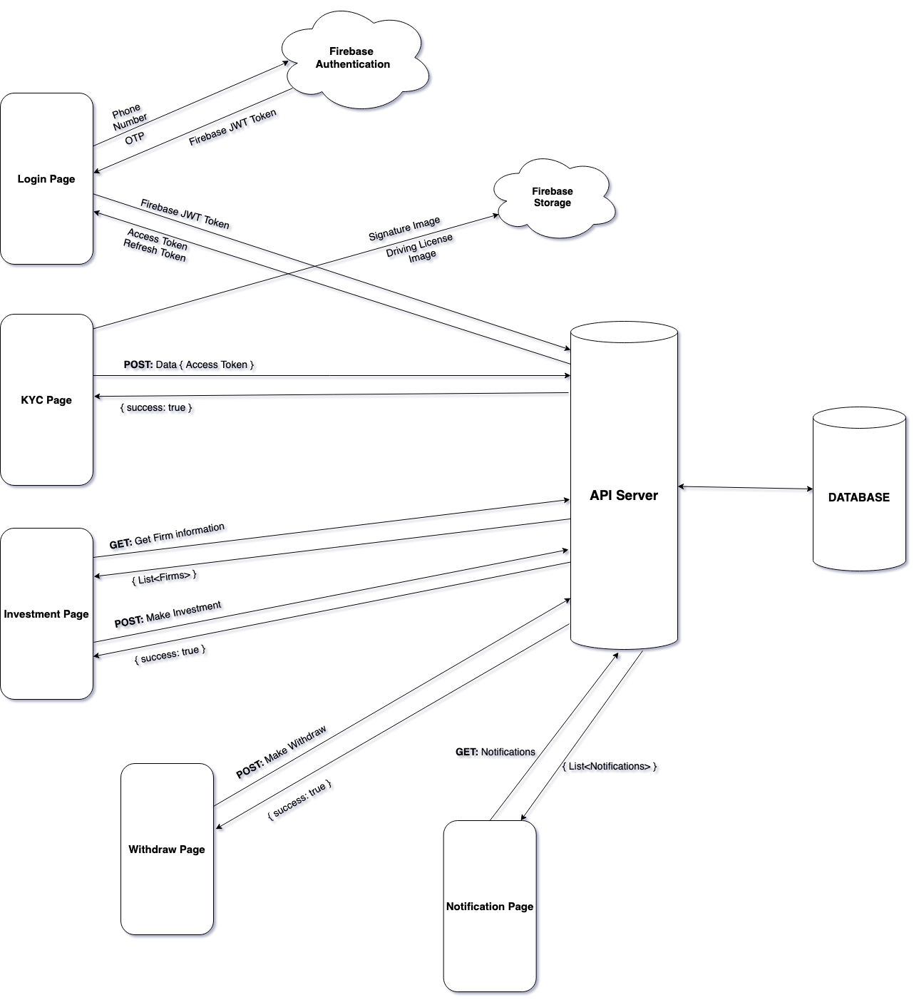

# App Flow

When a user logs in for the first time, he/she would have to provide their phone number after which they will receive an otp from firebase authentication. A JWT token will also be generated and an account of that user will be created and stored in the database. After filling the personal details a user can either update profile or skip and move straight to home page. 

If the user chooses to update his/her profile then he would have to fill all of his details which are required for KYC verification. The user would upload his/her signature and driving license on firebase storage. 

After completing the KYC verification , user will move to home page where he can make a get request to API server to get the firm information and invest in that respective firm. The user can also withdraw some of the amount he invested by making a post request to the API server. And then he/she can logout by making a post request with firebase JWT token to revoke the refresh token from firebase authentication.

