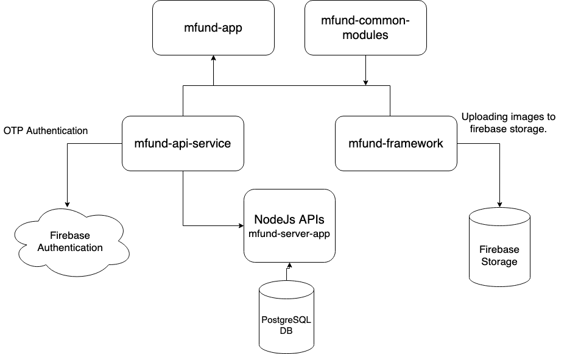

# Architecture

## High level Architecture

**mfund-server-app \(NodeJS APIs\):**

* Firebase is used in backend to revoke firebase authentication JWT token while logging out user from app.
* Using ExpressJS to create APIs. 
* Sequelize is used as ORM for PostgreSQL DB.

**mfund-api-service:**

* Contains all the repositories and api call for flutter app.
* Contains the definition of the functions responsible for OTP authentication through firebase authentication and uploading images on firebase storage.

**mfund-framework:**

* Contains BloCs, States and Events.

**mfund-common-modules:**

* Contains services, utils and common widget for both mfund-app and mfund-dashboard app.

