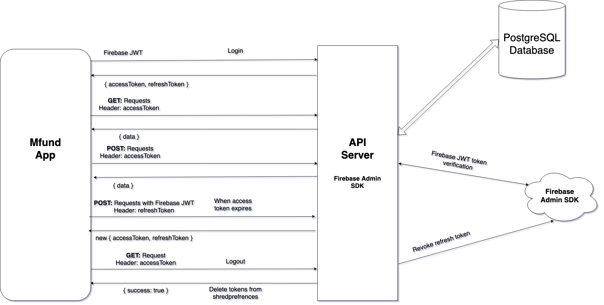

# Backend Flow

In the backend, authentication is handled via Firebase. App provide firebase JWT token via api and then server verifies that token using firebase admin SDK. Upon successful verification, server create new JWT tokens and send those tokens as a response. App uses these tokens for further request.

Backend uses [passport.js](http://www.passportjs.org/) for JWT verification. Once JWT is successfully verified then the requested data is either fetched or added in PostgreSQL database using [sequelize.js](https://sequelize.org/)

When the access token is expired then server create new access token after verifying the refresh token attached in header of the request.  If refresh token provided in header is expired then the firebase user's refresh token in revoked and token expired message is send back to the app, after which app delete shared preference and redirect the user to login page.

Similarly, in case of logout, firebase refresh token is revoked and shared preferences is deleted from the app.

