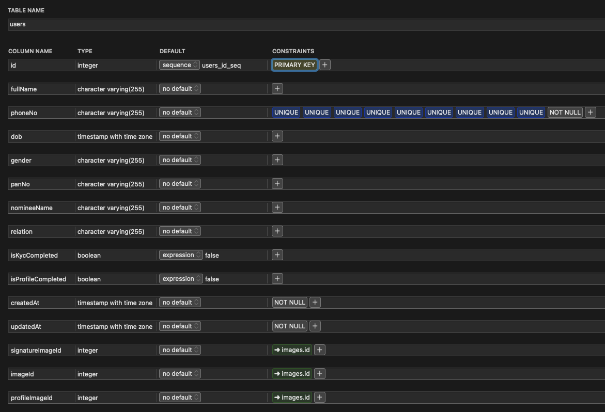
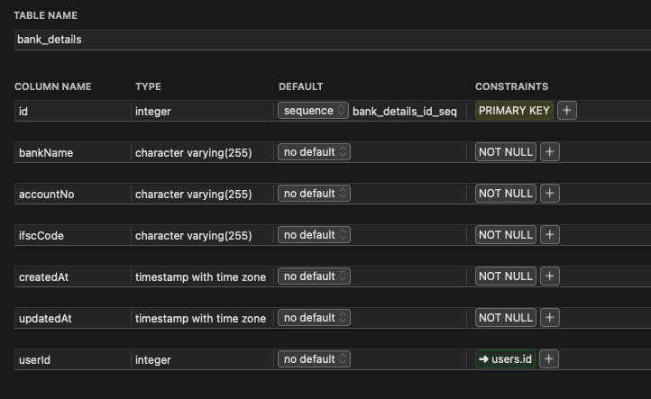
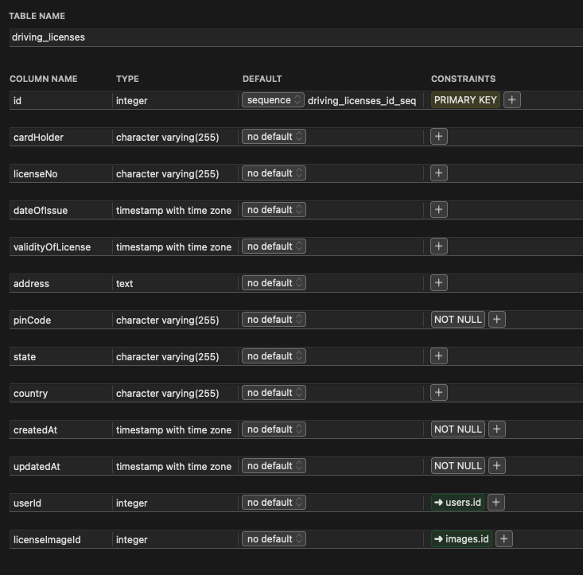
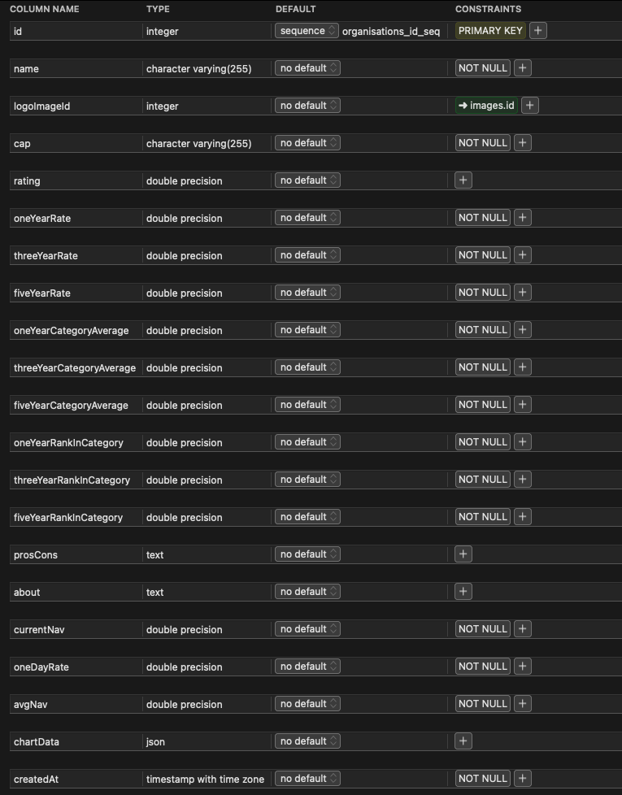
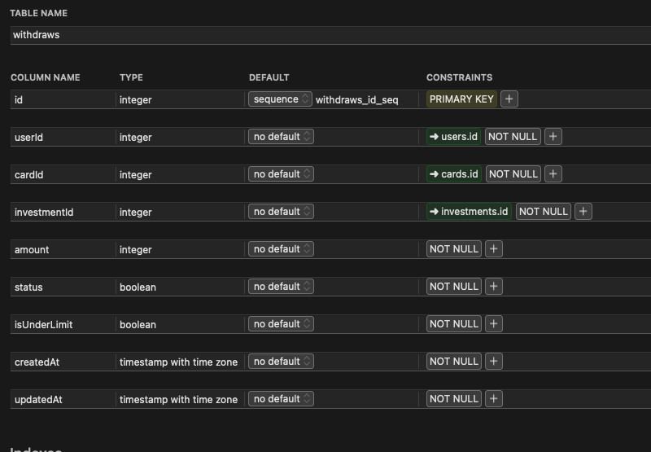
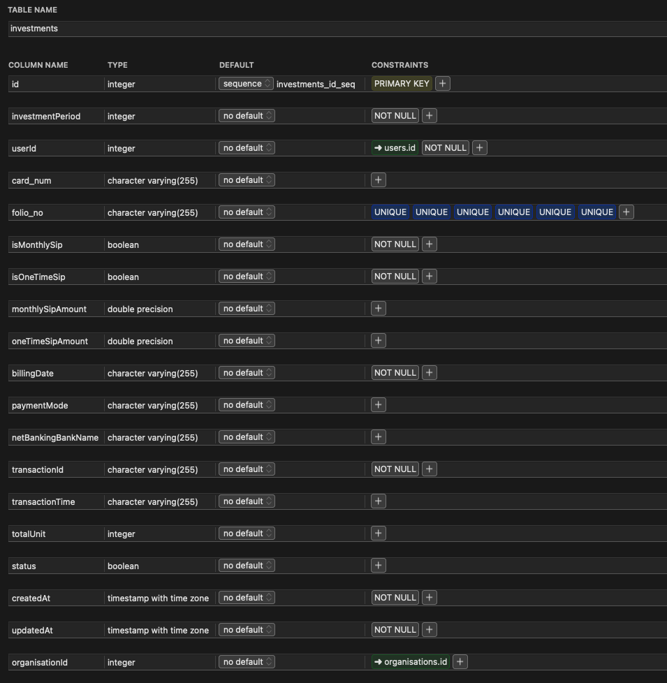

# Database Structure

PostgreSQL is a powerful, open source object-relational database system with over 30 years of active development that has earned it a strong reputation for reliability, feature robustness, and performance.

PostgreSQL has earned a strong reputation for its proven architecture, reliability, data integrity, robust feature set, extensibility, and the dedication of the open source community behind the software to consistently deliver performant and innovative solutions. PostgreSQL runs on [all major operating systems](https://www.postgresql.org/download/), has been [ACID](https://en.wikipedia.org/wiki/ACID)-compliant since 2001.

PostgreSQL comes with [many features](https://www.postgresql.org/about/featurematrix/) aimed to help developers build applications, administrators to protect data integrity and build fault-tolerant environments, and help you manage your data no matter how big or small the dataset. In addition to being [free and open source](https://www.postgresql.org/about/license/), PostgreSQL is highly extensible. 

### **Tables**

* **`users` Table -** This table keeps track of all the signed up user. Data in `users`updates as the user complete his/her KYC.

**\`\`**

* **`bank_details` Table -** This table has one-to-one relation with users table and keep bank details of a particular user.

**\`\`**

* **`driving_license` Table -** This table store Driving license data of the user for KYC purpose.

**\`\`**

* **`organisations` Table -** This table container data of Investment Firms/ Organisations and their SIP rates and NAV values. It also container previous NAV values for each firms to show as a chart in flutter app.

**\`\`**

* **`investments` Table -** This ****table contains data related to investments made by users in different firms.

**\`\`**

* **`withdraws` Table -** This table contains data of all the withdraw request made by the users.

